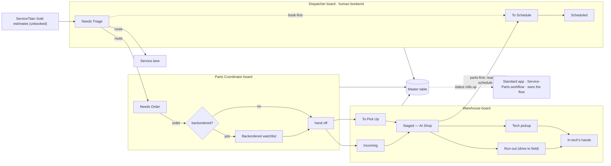

# Parts & Equipment — Team Workflow (the doing layer)

Status: **DRAFT, chat-stage design (2026-07-21). Not built.** Talking-stage capture of
the workflow we want to surface to the teams. Do not build until Jon says go.

Written in the vocabulary of the Standard app's **Workflow Engine**
(`standard/docs/workflow-engine.md`, `standard/docs/vision.md`) so the two line up.

---

## Where this sits (the seam with Standard)

Two layers, two jobs — hold the line and they never compete:

| | Orders app (**here**) | Standard app |
|---|---|---|
| Role | **Do the work** | **See the flow** |
| Owns | The parts/warehouse tasks + the master table | Nothing — aggregates status across apps |
| Rule | This is a system of record | "Aggregate status, never own the work" |

Standard already has a **Service-Parts workflow** that *reads* this app. So the boards
below are where the work actually happens; Standard just watches it roll up and flags
where it jams.

---

## The frame

Same engine idea as Standard: **a workflow is stages → steps.** Each step either fills
**automatically** from a signal (ServiceTitan, an order # entered, parts received) or is
a **manual gap** a person owns. Steps roll up to a stage; stages roll up to the job's
status in the **master table**.

The twist here: the work is split across teams, so instead of one long pipeline we run
**small boards in parallel** — a Dispatcher board at each end (route in, schedule out) and
two team boards (Parts, Warehouse) in the middle, each showing only its own lane. A job can
be moving on several at once — clear because each board is simplified to a few stages.

> Design goal: each board is small enough that clearing it is **satisfying** — few
> stages, obvious "move it forward" actions, visible throughput per person. Gamified.
> The complexity lives in the master table behind them, never on the board.

---

## The spectrum problem, and the dispatcher

Our org has two leaders (Service Manager, Install Manager), so the instinct is two hard
buckets. But the work is a **spectrum**:

```
pure repair ──────────── the middle ──────────── full system replace
 (Service)        (owned by BOTH teams)               (Install)
```

Software can't reliably classify the middle (BU + keyword guessing is lossy). So we don't
make it guess — we give the middle a **human**: the **Dispatcher**.

The Dispatcher is a **bookend** on the journey:
- **Front end** — triage/route incoming work to the right board(s); can send a job to
  *both* lanes when it truly spans teams. (This is Standard's "triage = confirm or
  override the workflow assignment," applied to team routing.)
- **Scheduling** — owns booking the job date in ServiceTitan.

---

## Intake (what feeds the boards)

Source of truth = ServiceTitan **Sold estimates whose line items aren't yet invoiced onto
a job** (`invoiceItemId` null). That's the "still needs parts ordered" signal. Deliberately
**not** included: non-Sold estimates, Sold estimates with no line items, already-invoiced
estimates, and revenue with no originating estimate (see the revenue-funnel note — a
validation item, not a designed path).

New items land in the **Dispatcher's intake**, get routed, and the parts pipeline begins.

---

## Scheduling is independent of parts

Scheduling and parts run on **separate tracks** — confirmed real by both patterns:

- **Book-first:** Dispatcher sets the date at intake; parts *catch up*. The date rides
  along as an **urgency flag** on the team boards (🗓 scheduled).
- **Parts-first:** parts flow through Warehouse; **"Staged" is the signal back to the
  Dispatcher** — "parts are in, ready to schedule."

So booking a job **never ejects it** from the parts/warehouse boards. A job leaves those
boards only when the **part is physically in the tech's hands** (picked up or run out) —
never because it got booked, and separate from ST `Completed`.

---

## Status vocabulary — mirror ServiceTitan

**Rule: use ServiceTitan's words for job status; don't invent our own.** The app previously
overloaded a home-grown `completed` and set it the moment an estimate's items got *booked
onto a job* — but in ST, **booked ≠ Completed**, and that mislabel is exactly how booked
jobs fell off everyone's radar.

Two separate things, kept separate:

| | Source | What it means | Governs the boards? |
|---|---|---|---|
| **Job status** | ServiceTitan | `Sold` → `Scheduled` (booked) → `Completed` (done + invoiced) → `Canceled` | **No** — it's context, shown as a flag (🗓 for Scheduled) |
| **Parts stage** | this app | `Needs Order → Ordered → Inbound → Staged → in tech's hands` | **Yes** — this alone moves a job across / off the boards |

`Completed` is reserved for its real ST meaning: the job was successfully completed and
invoiced for the customer. A job can be ST-`Completed` and *still* sit on Warehouse if the
part never made it out — that's the safety, not a bug.

---

## The boards (three, in parallel)

### Dispatcher board (bookend — front end + scheduling)
The human that directs traffic. A bookend: routes at the front, owns scheduling.

| Stage | Move-it-forward action | Fed by |
|---|---|---|
| **Needs Triage** (intake) | Route → Parts · Service · Both | new Sold estimates land here |
| **To Schedule** | Schedule (set date) | book-first jobs + Warehouse "Staged" hand-back |
| **Scheduled** | (done from dispatch's view; date flows to boards as 🗓) | — |

### Parts Coordinator board (`/parts`)
Lean lane — a clean order never lingers; the moment it's placed it hands to Warehouse.

| Stage | Move-it-forward action |
|---|---|
| **Needs Order** | Ship to Shop · Pickup · Backordered |
| **Backordered** (watchlist) | Part in → Ship to Shop / Pickup |

### Warehouse board (`/warehouse`)
Picks up the handoff — get parts into the shop, then out to the tech.

| Stage | Move-it-forward action |
|---|---|
| **To Pick Up** (at a supply house) | Picked up → At Shop |
| **Incoming** (carrier shipping it) | Received → At Shop |
| **Staged — At Shop** | Tech Pickup · Needs Run-out — (also signals Dispatcher "ready to schedule") |
| **Run-out** (Warehouse drives it to the crew) | Delivered → in tech's hands |
| **In tech's hands** (picked up or delivered) | done — leaves the boards |

Two last-mile paths after Staged: **Tech pickup** (crew grabs it at the shop, usually
morning — cheap) or **Warehouse run-out** (drive it to the field — costly, tracked).

> **Terminology watch-out:** "Pickup" means two different legs — don't let them collide.
> **Supplier → shop** (Parts board: "Ship to Shop" vs "Pickup" at the supply house) is a
> different thing from **shop → tech** (this tail: "Tech pickup" vs "Run-out").

---

## The flow (parallel, but clear)



---

## Master table

Every board action writes to one **master table** (today's `pe_orders`). The boards are
**views** over it; leadership/reporting reads the master. The two-manager org split becomes
two *lenses*, not two data silos — a middle job can appear in both.

---

## Vision / future (not now — direction)

- **Run-out visibility:** start by just marking the last-mile path (**Tech pickup** vs
  **Run-out**) as a state. That one flag makes "how many jobs need a run-out today" a
  trivial data pull — no cost/mileage fields needed yet. Refine tracking (cost, mileage,
  who ran it) in time.
- **Morning pickup SMS:** auto-text the tech — *"🌅 pick up your part at the warehouse
  before you head out"* — hung off the Tech-pickup state. Reachable now: this app already
  sends texts via **Quo** and has a notifications engine. This is where we're headed —
  proactive accountability, not a dashboard someone has to check.

---

## Open questions (defer until hit)

- **Dispatcher UI:** its own board/lane at the very front, or a triage inbox off to the
  side? (Leaning: its own front lane — every new item lands there.)
- **Gamification mechanics:** what's tracked/scored — throughput per person, time-in-stage,
  streaks? Keep it simple to start.
- **Service lane:** this doc details Parts + Warehouse; the Service team's board stages
  aren't drawn yet.
- **"Both teams" routing:** exact behavior when the Dispatcher sends one job to two lanes
  (one master row shown twice, or a split?).
- **Validate:** does parts-needing work ever arrive with no Sold estimate? (Believed no.)
```
